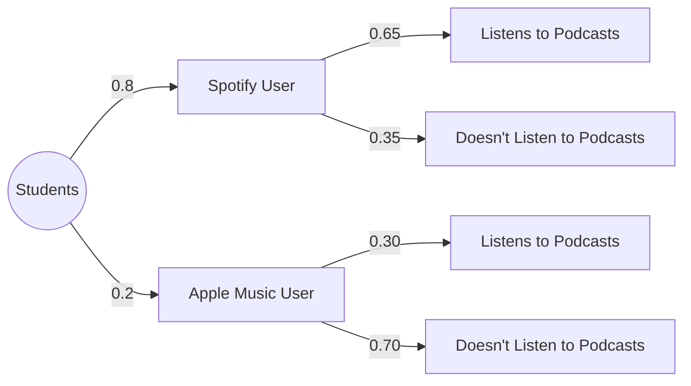

# Lecture 35: Classification

```mermaid
graph LR
    Root((Students)) -->|0.8| A[Spotify User]
    Root -->|0.2| D[Apple Music User]
    A -->|0.65| B[Listens to Podcasts]
    A -->|0.35| C[Doesn't Listen to Podcasts]
    D -->|0.30| E[Listens to Podcasts]
    D -->|0.70| F[Doesn't Listen to Podcasts]
```